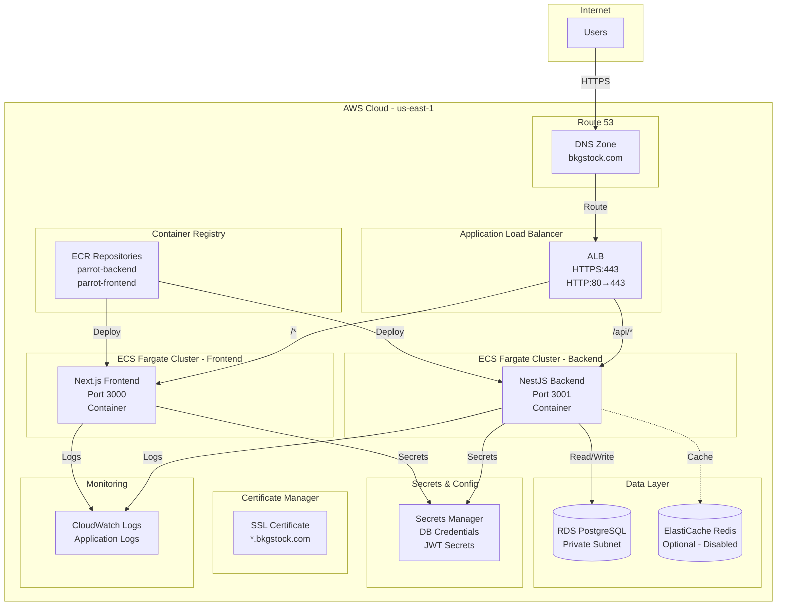
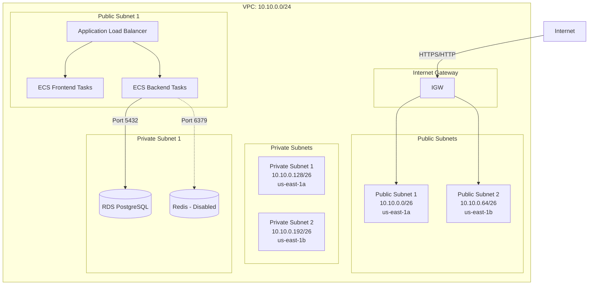
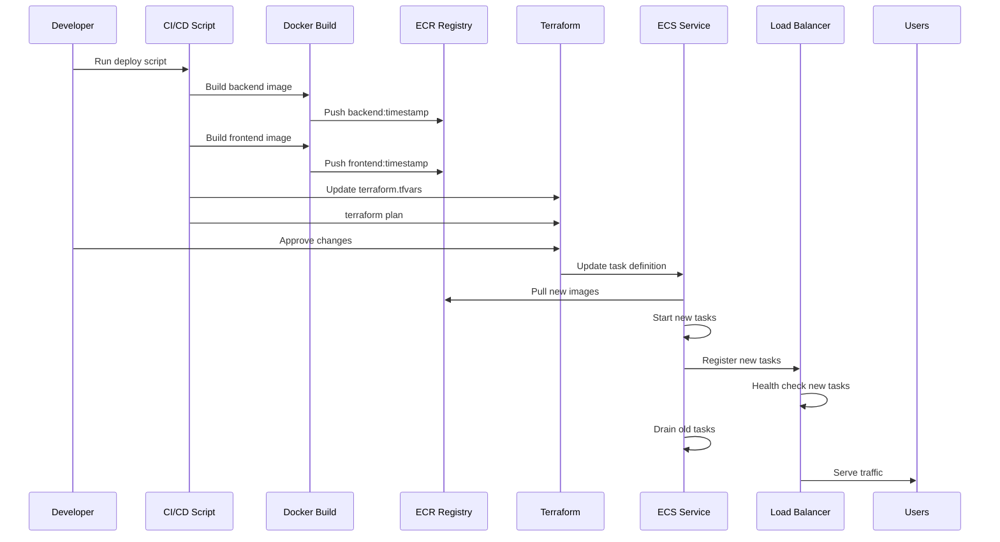

# Parrot Infrastructure Documentation

## Table of Contents

1. [Overview](#overview)
2. [Architecture](#architecture)
3. [Infrastructure Components](#infrastructure-components)
4. [Network Architecture](#network-architecture)
5. [Deployment Architecture](#deployment-architecture)
6. [Security Architecture](#security-architecture)
7. [Deployment Process](#deployment-process)
8. [Monitoring & Logging](#monitoring--logging)
9. [Cost Analysis](#cost-analysis)
10. [Troubleshooting](#troubleshooting)
11. [Scaling Strategy](#scaling-strategy)

---

## Overview

The Parrot infrastructure is a production-ready, cloud-native deployment on AWS using Infrastructure as Code (Terraform). The system is designed for high availability, scalability, and security while maintaining cost efficiency.

### Key Characteristics

- **Cloud Provider**: AWS (us-east-1)
- **Infrastructure as Code**: Terraform
- **Container Orchestration**: Amazon ECS (Fargate)
- **Database**: Amazon RDS PostgreSQL
- **Caching**: Amazon ElastiCache Redis (optional, currently disabled)
- **Load Balancing**: Application Load Balancer (ALB)
- **DNS**: Amazon Route 53
- **SSL/TLS**: AWS Certificate Manager (ACM)
- **Secrets Management**: AWS Secrets Manager
- **Logging**: Amazon CloudWatch Logs

### Current Environment

- **Environment**: `dev`
- **Domain**: `bkgstock.com`
- **Region**: `us-east-1`
- **Monthly Cost**: ~$110-120 USD

---

## Architecture

### High-Level Architecture Diagram



### Network Architecture Diagram



### Deployment Flow Diagram



---

## Infrastructure Components

### 1. Network Module (`modules/network`)

**Purpose**: Creates the foundational VPC and networking infrastructure.

**Resources Created**:
- VPC (10.10.0.0/24)
- Internet Gateway
- 2 Public Subnets (10.10.0.0/26, 10.10.0.64/26) across 2 AZs
- 2 Private Subnets (10.10.0.128/26, 10.10.0.192/26) across 2 AZs
- Route Tables (Public and Private)
- NAT Gateway (optional, currently disabled for cost savings)

**Key Features**:
- Multi-AZ deployment for high availability
- Public subnets for ALB and ECS tasks
- Private subnets for database and cache
- DNS hostnames and DNS support enabled

### 2. RDS Module (`modules/rds`)

**Purpose**: Managed PostgreSQL database instance.

**Configuration**:
- **Engine**: PostgreSQL
- **Instance Class**: `db.t3.micro` (1 vCPU, 1 GB RAM)
- **Storage**: 20 GB (gp2)
- **Backup Retention**: 1 day
- **Multi-AZ**: Disabled (cost optimization)
- **Encryption**: Enabled at rest
- **Network**: Private subnets only
- **Security**: VPC security group (port 5432)

**Credentials**:
- Stored in AWS Secrets Manager
- Auto-generated 24-character password
- Username: `parrot_admin`
- Database: `parrot`

### 3. Redis Module (`modules/redis`)

**Purpose**: In-memory caching layer (currently disabled).

**Configuration**:
- **Engine**: Redis
- **Node Type**: `cache.t3.micro` (when enabled)
- **Network**: Private subnets
- **Status**: Disabled (`enabled = false`)

**Note**: Can be enabled by setting `enabled = true` in the module call.

### 4. ECR Module (`modules/ecr`)

**Purpose**: Private Docker container registry.

**Repositories**:
1. `parrot-backend` - Backend NestJS application
2. `parrot-frontend` - Frontend Next.js application

**Features**:
- Image scanning on push (vulnerability detection)
- Lifecycle policy (retain last 10 images)
- Mutable image tags

### 5. ECS Module (`modules/ecs`)

**Purpose**: Container orchestration using Fargate (serverless containers).

**Backend Service**:
- **Cluster**: `parrot-dev-backend`
- **Service**: `parrot-dev-backend`
- **Task CPU**: 256 (0.25 vCPU)
- **Task Memory**: 512 MB
- **Desired Count**: 1
- **Port**: 3001
- **Health Check**: `/api/health`

**Frontend Service**:
- **Cluster**: `parrot-dev-frontend`
- **Service**: `parrot-dev-frontend`
- **Task CPU**: 256 (0.25 vCPU)
- **Task Memory**: 512 MB
- **Desired Count**: 1
- **Port**: 3000
- **Health Check**: `/landing`

**Features**:
- Automatic task replacement on image update
- Load balancer integration
- CloudWatch logging
- Secrets injection from Secrets Manager
- Execute command enabled (for debugging)

### 6. Application Load Balancer (ALB)

**Purpose**: Distributes traffic and handles SSL termination.

**Configuration**:
- **Type**: Application Load Balancer
- **Scheme**: Internet-facing
- **Subnets**: Public subnets (2 AZs)
- **Security Group**: Allows HTTP (80) and HTTPS (443) from internet

**Listeners**:
1. **HTTP (Port 80)**: Redirects to HTTPS (301)
2. **HTTPS (Port 443)**: 
   - Certificate: ACM certificate for `bkgstock.com` and `www.bkgstock.com`
   - Routing Rules:
     - Priority 50: `www.bkgstock.com` → redirect to `bkgstock.com`
     - Priority 100: `/api/*` → Backend target group
     - Priority 200: `/*` → Frontend target group

**Target Groups**:
- **Backend**: Port 3001, health check `/api/health`
- **Frontend**: Port 3000, health check `/landing`

### 7. Route 53

**Purpose**: DNS management and domain routing.

**Configuration**:
- **Zone**: `bkgstock.com`
- **Records**:
  - `bkgstock.com` → ALB (A record, alias)
  - `www.bkgstock.com` → ALB (A record, alias)

**Note**: Name servers must be configured at domain registrar.

### 8. AWS Certificate Manager (ACM)

**Purpose**: SSL/TLS certificate management.

**Certificate**:
- **Domain**: `bkgstock.com`
- **SAN**: `www.bkgstock.com`
- **Validation**: DNS validation
- **Status**: Auto-validated via Route 53

### 9. Secrets Manager

**Purpose**: Secure storage of sensitive configuration.

**Secrets**:
1. **`parrot-dev-db-credentials`**:
   - Database username
   - Database password
   - Database host
   - Database port
   - Database name
   - Database URL (connection string)

2. **`parrot-dev-app-env`**:
   - JWT secret
   - JWT refresh secret
   - JWT expiration (15m)
   - JWT refresh expiration (7d)

**Access**: ECS tasks have IAM permissions to read secrets.

### 10. CloudWatch Logs

**Purpose**: Centralized application logging.

**Log Groups**:
- `/aws/ecs/parrot-dev-backend` (30-day retention)
- `/aws/ecs/parrot-dev-frontend` (30-day retention)

**Features**:
- Automatic log collection from ECS tasks
- Searchable and queryable
- Metric filters for alerting

---

## Network Architecture

### VPC Structure

```
VPC: 10.10.0.0/24
├── Public Subnets (Internet-facing)
│   ├── 10.10.0.0/26 (us-east-1a) - ALB, ECS tasks
│   └── 10.10.0.64/26 (us-east-1b) - ALB, ECS tasks
│
└── Private Subnets (Isolated)
    ├── 10.10.0.128/26 (us-east-1a) - RDS, Redis
    └── 10.10.0.192/26 (us-east-1b) - RDS, Redis
```

### Security Groups

#### ALB Security Group
- **Inbound**: HTTP (80), HTTPS (443) from 0.0.0.0/0
- **Outbound**: All traffic

#### ECS Service Security Group
- **Inbound**: 
  - Port 3001 from ALB security group (backend)
  - Port 3000 from ALB security group (frontend)
- **Outbound**: All traffic (for API calls, database access)

#### Database Security Group
- **Inbound**: PostgreSQL (5432) from VPC CIDR (10.10.0.0/16)
- **Outbound**: All traffic

#### Redis Security Group
- **Inbound**: Redis (6379) from VPC CIDR (10.10.0.0/16)
- **Outbound**: All traffic

### Network Flow

```
Internet
  ↓ (HTTPS/HTTP)
Internet Gateway
  ↓
Public Subnet (ALB)
  ↓ (HTTP)
ECS Tasks (Public Subnet)
  ↓ (Port 5432)
Private Subnet (RDS)
```

**Note**: ECS tasks are in public subnets but only accept traffic from ALB. Database is in private subnets with no internet access.

---

## Deployment Architecture

### Container Images

**Backend Image** (`parrot-backend`):
- Base: Node.js
- Build: Multi-stage Dockerfile
- Target: `production`
- Port: 3001
- Environment Variables:
  - `NODE_ENV=production`
  - `PORT=3001`
  - `API_PREFIX=api`
  - `CORS_ORIGINS` (comma-separated)
  - `SEED_DB=true`
  - `PRISMA_DB_PUSH_ON_START=false`

**Frontend Image** (`parrot-frontend`):
- Base: Node.js
- Build: Multi-stage Dockerfile (Next.js standalone)
- Target: `runner`
- Port: 3000
- Environment Variables:
  - `NODE_ENV=production`
  - `NEXT_PUBLIC_API_BASE_URL=https://bkgstock.com/api`
  - `NEXT_PUBLIC_AUTH_ONLY_MODE=false`

### Deployment Process

1. **Build Phase**:
   ```bash
   docker build --target production -t parrot-backend:tag backend/
   docker build --target runner -t parrot-frontend:tag client/
   ```

2. **Push Phase**:
   ```bash
   docker push <account>.dkr.ecr.us-east-1.amazonaws.com/parrot-backend:tag
   docker push <account>.dkr.ecr.us-east-1.amazonaws.com/parrot-frontend:tag
   ```

3. **Terraform Update**:
   - Update `terraform.tfvars` with new image tags
   - Run `terraform plan` to preview changes
   - Run `terraform apply` to deploy

4. **ECS Update**:
   - ECS creates new task definition with new image
   - Starts new tasks with new image
   - Registers new tasks with ALB
   - ALB health checks new tasks
   - Once healthy, drains old tasks
   - Zero-downtime deployment

### Deployment Script

Location: `scripts/deploy-to-production.sh`

**Features**:
- Automatic timestamp-based image tagging
- ECR login and authentication
- Docker build and push
- Terraform variable update
- Interactive approval for Terraform apply

**Usage**:
```bash
cd /home/bkg/parrot
./scripts/deploy-to-production.sh
```

---

## Security Architecture

### Security Layers

1. **Network Security**:
   - VPC isolation
   - Security groups (firewall rules)
   - Private subnets for database
   - No direct internet access to database

2. **Application Security**:
   - HTTPS only (HTTP redirects to HTTPS)
   - SSL/TLS certificates (ACM)
   - CORS configuration
   - JWT authentication

3. **Secrets Management**:
   - AWS Secrets Manager (encrypted at rest)
   - IAM role-based access
   - No secrets in code or environment variables
   - Automatic rotation capability

4. **Container Security**:
   - Private ECR repositories
   - Image scanning on push
   - Minimal base images
   - Non-root user execution (best practice)

5. **Database Security**:
   - Encryption at rest
   - Encryption in transit
   - VPC isolation
   - Security group restrictions
   - Automated backups

### IAM Roles

**ECS Task Execution Role**:
- Permissions:
  - Pull images from ECR
  - Write logs to CloudWatch
  - Read secrets from Secrets Manager

**No additional IAM roles** - using AWS managed policies where possible.

---

## Deployment Process

### Prerequisites

1. **AWS CLI** configured with appropriate credentials
2. **Terraform** >= 1.6.0 installed
3. **Docker** installed and running
4. **Domain** registered and ready for Route 53

### Initial Setup

1. **Setup Terraform Backend**:
   ```bash
   ./scripts/setup-terraform-backend.sh
   ```
   This creates:
   - S3 bucket for Terraform state
   - DynamoDB table for state locking
   - Encryption and versioning enabled

2. **Initialize Terraform**:
   ```bash
   cd infra/terraform/environments/dev
   terraform init
   ```

3. **Configure Variables**:
   Edit `terraform.tfvars`:
   ```hcl
   environment         = "dev"
   aws_region          = "us-east-1"
   root_domain         = "bkgstock.com"
   backend_image_tag   = "latest"
   frontend_image_tag  = "latest"
   backend_desired_count = 1
   frontend_desired_count = 1
   cors_origins        = ["https://bkgstock.com", "https://www.bkgstock.com"]
   auth_only_mode      = false
   ```

4. **Plan and Apply**:
   ```bash
   terraform plan
   terraform apply
   ```

5. **Configure DNS**:
   - Get name servers from Terraform output:
     ```bash
     terraform output route53_nameservers
     ```
   - Update domain registrar with these name servers

### Regular Deployments

Use the deployment script:

```bash
cd /home/bkg/parrot
./scripts/deploy-to-production.sh
```

**What it does**:
1. Builds Docker images with timestamp tags
2. Pushes to ECR
3. Updates Terraform variables
4. Runs `terraform plan` (shows preview)
5. Prompts for approval
6. Runs `terraform apply` (deploys)

### Manual Deployment Steps

If you prefer manual deployment:

1. **Build and Push Images**:
   ```bash
   # Backend
   cd backend
   docker build --target production -t parrot-backend:$(date +%Y%m%d%H%M%S) .
   aws ecr get-login-password --region us-east-1 | docker login --username AWS --password-stdin <account>.dkr.ecr.us-east-1.amazonaws.com
   docker tag parrot-backend:tag <account>.dkr.ecr.us-east-1.amazonaws.com/parrot-backend:tag
   docker push <account>.dkr.ecr.us-east-1.amazonaws.com/parrot-backend:tag
   
   # Frontend
   cd ../client
   docker build --target runner -t parrot-frontend:$(date +%Y%m%d%H%M%S) .
   docker tag parrot-frontend:tag <account>.dkr.ecr.us-east-1.amazonaws.com/parrot-frontend:tag
   docker push <account>.dkr.ecr.us-east-1.amazonaws.com/parrot-frontend:tag
   ```

2. **Update Terraform**:
   ```bash
   cd infra/terraform/environments/dev
   # Edit terraform.tfvars with new image tags
   terraform plan
   terraform apply
   ```

3. **Monitor Deployment**:
   ```bash
   aws ecs describe-services \
     --cluster parrot-dev-backend \
     --services parrot-dev-backend \
     --region us-east-1
   ```

---

## Monitoring & Logging

### CloudWatch Logs

**Access Logs**:
```bash
# Backend logs
aws logs tail /aws/ecs/parrot-dev-backend --follow

# Frontend logs
aws logs tail /aws/ecs/parrot-dev-frontend --follow
```

**Search Logs**:
```bash
aws logs filter-log-events \
  --log-group-name /aws/ecs/parrot-dev-backend \
  --filter-pattern "ERROR" \
  --start-time $(date -d '1 hour ago' +%s)000
```

### ECS Service Monitoring

**Check Service Status**:
```bash
aws ecs describe-services \
  --cluster parrot-dev-backend \
  --services parrot-dev-backend \
  --region us-east-1 \
  --query 'services[0].{Status:status,Running:runningCount,Desired:desiredCount,Events:events[0:3]}'
```

**Check Task Status**:
```bash
aws ecs list-tasks \
  --cluster parrot-dev-backend \
  --service-name parrot-dev-backend \
  --region us-east-1
```

### Health Checks

**ALB Health Checks**:
- Backend: `GET /api/health` (expects 200)
- Frontend: `GET /landing` (expects 200)
- Interval: 30 seconds
- Timeout: 5 seconds
- Healthy threshold: 2 consecutive successes
- Unhealthy threshold: 2 consecutive failures

**Application Health Endpoints**:
- Backend: `/api/health`
- Frontend: `/landing` (or any public route)

### Metrics to Monitor

1. **ECS Metrics**:
   - CPU utilization
   - Memory utilization
   - Task count (running vs desired)

2. **ALB Metrics**:
   - Request count
   - Response time
   - Error rate (4xx, 5xx)
   - Target health

3. **RDS Metrics**:
   - CPU utilization
   - Database connections
   - Storage space
   - Read/Write IOPS

4. **Application Metrics**:
   - API response times
   - Error rates
   - Authentication failures

---

## Cost Analysis

### Monthly Cost Breakdown

| Component | Service | Estimated Cost | % of Total |
|-----------|---------|----------------|------------|
| Compute | ECS Fargate (2 tasks) | $30 | 27% |
| Database | RDS PostgreSQL (db.t3.micro) | $12 | 11% |
| Load Balancer | ALB | $16 | 15% |
| DNS | Route 53 | $40 | 36% |
| Logging | CloudWatch Logs | $8 | 7% |
| Container Registry | ECR | $4 | 4% |
| **Total** | | **~$110** | **100%** |

### Cost Optimization Strategies

1. **Current Optimizations**:
   - NAT Gateway disabled (saves ~$32/month)
   - Redis disabled (saves ~$15/month)
   - Single-AZ RDS (saves ~$12/month)
   - Minimal task resources (256 CPU, 512 MB RAM)

2. **Future Optimizations**:
   - Reserved Instances (30% discount with 1-year commitment)
   - Spot Instances for non-critical workloads
   - S3 for static assets (cheaper than ALB)
   - CloudFront CDN (reduces ALB costs)

3. **Scaling Costs**:
   - Current: ~$110/month (1 user)
   - 100 users: ~$120/month
   - 1,000 users: ~$180/month
   - 10,000 users: ~$600-800/month

---

## Troubleshooting

### Common Issues

#### 1. ECS Tasks Not Starting

**Symptoms**: Tasks stuck in PENDING or STOPPED state

**Diagnosis**:
```bash
aws ecs describe-tasks \
  --cluster parrot-dev-backend \
  --tasks <task-id> \
  --region us-east-1
```

**Common Causes**:
- Image pull errors (check ECR permissions)
- Insufficient resources (CPU/memory)
- Security group misconfiguration
- Secrets Manager access denied

**Solutions**:
- Verify IAM role has ECR pull permissions
- Check task CPU/memory limits
- Verify security groups allow traffic
- Verify Secrets Manager ARN in task definition

#### 2. Health Check Failures

**Symptoms**: ALB marks targets as unhealthy

**Diagnosis**:
```bash
aws elbv2 describe-target-health \
  --target-group-arn <target-group-arn> \
  --region us-east-1
```

**Common Causes**:
- Application not responding on health check path
- Port mismatch
- Security group blocking ALB traffic

**Solutions**:
- Verify health check endpoint returns 200
- Check container port matches target group port
- Verify security group allows ALB → ECS traffic

#### 3. Database Connection Issues

**Symptoms**: Backend cannot connect to RDS

**Diagnosis**:
- Check CloudWatch logs for connection errors
- Verify security group allows port 5432 from ECS
- Check Secrets Manager secret is accessible

**Solutions**:
- Verify database security group allows VPC CIDR
- Check DATABASE_URL in Secrets Manager
- Verify RDS is in private subnet

#### 4. SSL Certificate Issues

**Symptoms**: HTTPS not working, certificate errors

**Diagnosis**:
```bash
aws acm describe-certificate \
  --certificate-arn <cert-arn> \
  --region us-east-1
```

**Common Causes**:
- DNS validation not completed
- Certificate not attached to ALB listener
- Domain name mismatch

**Solutions**:
- Complete DNS validation in Route 53
- Verify certificate ARN in ALB listener
- Check domain names match certificate

#### 5. Deployment Failures

**Symptoms**: Terraform apply fails

**Common Causes**:
- State file locked (another apply in progress)
- Resource conflicts
- IAM permissions insufficient

**Solutions**:
- Wait for other apply to complete
- Check for resource name conflicts
- Verify IAM permissions for all resources

### Debugging Commands

**View ECS Task Logs**:
```bash
aws logs tail /aws/ecs/parrot-dev-backend --follow
```

**Execute Command in Running Container**:
```bash
aws ecs execute-command \
  --cluster parrot-dev-backend \
  --task <task-id> \
  --container backend \
  --command "/bin/sh" \
  --interactive
```

**Check ALB Target Health**:
```bash
aws elbv2 describe-target-health \
  --target-group-arn $(terraform output -raw backend_target_group_arn)
```

**View RDS Status**:
```bash
aws rds describe-db-instances \
  --db-instance-identifier parrot-dev-db \
  --region us-east-1
```

---

## Scaling Strategy

### Horizontal Scaling

**Current**: 1 task per service

**Scale Up**:
```bash
# Update terraform.tfvars
backend_desired_count = 2
frontend_desired_count = 2

# Apply
terraform apply
```

**Auto Scaling** (Future):
- Configure ECS Service Auto Scaling
- Scale based on CPU/memory utilization
- Scale based on ALB request count

### Vertical Scaling

**Increase Task Resources**:
- Edit ECS module variables:
  - `task_cpu`: 256 → 512 or 1024
  - `task_memory`: 512 → 1024 or 2048

**Database Scaling**:
- Upgrade instance class: `db.t3.micro` → `db.t3.small`
- Enable Multi-AZ for high availability
- Increase storage as needed

### Performance Optimization

1. **Enable Redis**:
   - Set `enabled = true` in Redis module
   - Update application to use Redis for caching

2. **Enable CloudFront**:
   - Add CloudFront distribution in front of ALB
   - Cache static assets
   - Reduce ALB costs

3. **Database Optimization**:
   - Enable connection pooling
   - Add read replicas for read-heavy workloads
   - Optimize queries and indexes

4. **Container Optimization**:
   - Use multi-stage builds
   - Minimize image size
   - Optimize startup time

---

## Terraform Module Reference

### Module Structure

```
infra/terraform/
├── modules/
│   ├── network/     # VPC, subnets, routing
│   ├── rds/         # PostgreSQL database
│   ├── redis/       # ElastiCache Redis
│   ├── ecr/         # Container registry
│   └── ecs/         # Container orchestration
├── environments/
│   └── dev/         # Development environment
│       ├── main.tf
│       ├── variables.tf
│       ├── outputs.tf
│       └── terraform.tfvars
├── backend.tf       # State backend configuration
├── providers.tf    # Provider configuration
└── versions.tf      # Version constraints
```

### Key Variables

**Environment Variables** (`environments/dev/variables.tf`):
- `environment`: Environment name (dev/stage/prod)
- `aws_region`: AWS region
- `root_domain`: Domain name
- `backend_image_tag`: ECR image tag for backend
- `frontend_image_tag`: ECR image tag for frontend
- `backend_desired_count`: Number of backend tasks
- `frontend_desired_count`: Number of frontend tasks
- `cors_origins`: Allowed CORS origins
- `auth_only_mode`: Maintenance mode flag

### Outputs

**Available Outputs** (`environments/dev/outputs.tf`):
- `vpc_id`: VPC identifier
- `public_subnet_ids`: Public subnet IDs
- `private_subnet_ids`: Private subnet IDs
- `db_endpoint`: RDS endpoint
- `db_port`: RDS port
- `db_credentials_secret_arn`: Secrets Manager ARN
- `redis_endpoint`: Redis endpoint (if enabled)
- `ecr_repositories`: ECR repository URLs
- `alb_dns_name`: ALB DNS name
- `ecs_backend_cluster_id`: Backend cluster ID
- `ecs_backend_service_name`: Backend service name
- `route53_nameservers`: Route 53 name servers

---

## Best Practices

### Infrastructure

1. **State Management**:
   - Use remote state (S3 backend)
   - Enable state locking (DynamoDB)
   - Enable state encryption
   - Version state bucket

2. **Resource Naming**:
   - Use consistent naming: `parrot-{environment}-{resource}`
   - Tag all resources
   - Use variables for environment names

3. **Security**:
   - Least privilege IAM roles
   - Encrypt secrets at rest
   - Use security groups strictly
   - Enable VPC flow logs (optional)

4. **Cost Management**:
   - Use cost allocation tags
   - Monitor AWS Cost Explorer
   - Set up billing alerts
   - Review and optimize regularly

### Deployment

1. **Image Tagging**:
   - Use timestamp-based tags for deployments
   - Keep `latest` tag for convenience
   - Tag with git commit SHA for traceability

2. **Rollback Strategy**:
   - Keep previous image tags in ECR
   - Update `terraform.tfvars` with previous tag
   - Run `terraform apply` to rollback

3. **Testing**:
   - Test in dev environment first
   - Use `terraform plan` to preview changes
   - Monitor deployments closely

---

## Additional Resources

### AWS Documentation

- [ECS Fargate](https://docs.aws.amazon.com/AmazonECS/latest/developerguide/AWS_Fargate.html)
- [Application Load Balancer](https://docs.aws.amazon.com/elasticloadbalancing/latest/application/)
- [RDS PostgreSQL](https://docs.aws.amazon.com/AmazonRDS/latest/UserGuide/CHAP_PostgreSQL.html)
- [Route 53](https://docs.aws.amazon.com/route53/)
- [Secrets Manager](https://docs.aws.amazon.com/secretsmanager/)

### Terraform Documentation

- [Terraform AWS Provider](https://registry.terraform.io/providers/hashicorp/aws/latest/docs)
- [Terraform Best Practices](https://www.terraform.io/docs/cloud/guides/recommended-practices/index.html)

### Internal Documentation

- Cost Justification: `infra/terraform/README.md`
- Deployment Scripts: `scripts/`

---

## Contact & Support

For infrastructure issues or questions:
1. Check CloudWatch logs
2. Review Terraform state
3. Consult this documentation
4. Review AWS service health dashboards

---

**Last Updated**: 2024-12-01
**Document Version**: 1.0
**Maintained By**: Infrastructure Team

